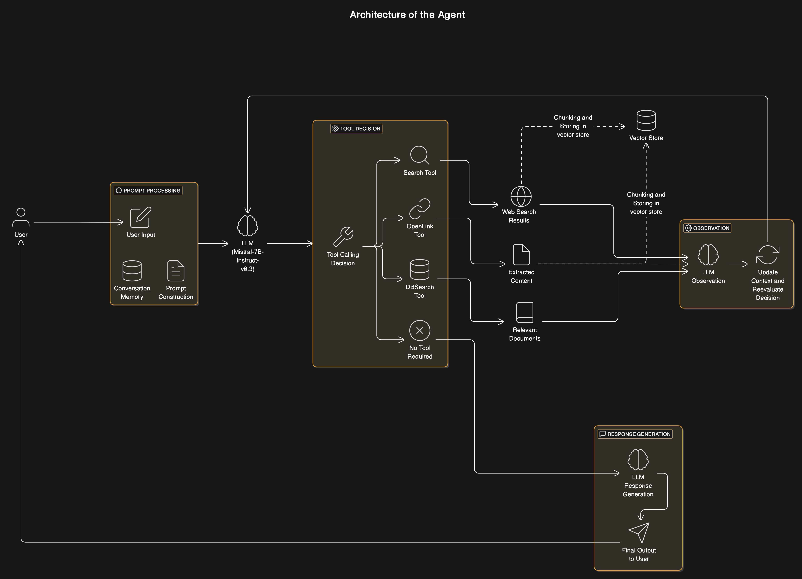

# LinkMind


LinkMind is an interactive conversation application powered by a modern Langchain-based agent that integrates natural language processing, web search, document scraping, and vector search. Built using Streamlit for its user interface, LinkMind leverages the Hugging Face endpoint along with a custom FAISS vector store to deliver context-rich, intelligent responses.

## Overview

LinkMind is designed to:
- Answer user questions in detail while explaining the reasoning process.
- Utilize a reactive chat agent powered by a chain-of-thought prompt based on React.
- Seamlessly integrate with web search and content extraction tools.
- Cache and store knowledge using an in-memory FAISS vector store enhanced with Hugging Face embeddings.
- Provide error recovery and session memory, preserving conversation context over time.

## Features

- **Chat Interface:** A modern Streamlit-based chat UI that mimics conversational apps.
- **Chain-of-Thought Reasoning:** Uses a multi-step reactive agent workflow to generate detailed and accurate answers.
- **Tool Integration:** Includes tools for web search, content extraction, and database queries:
  - *Search Tool:* Uses DuckDuckGo for retrieving web and news results.
  - *OpenLink Tool:* Extracts and processes webpage content.
  - *DBSearch Tool:* Retrieves relevant documents from a FAISS-based vector store.
- **Embeddings & Vector Store:** Utilizes Hugging Face’s sentence transformer to compute embeddings and stores document chunks in FAISS.
- **Caching & Memory:** Employs an in-memory cache to optimize LLM calls and conversation memory to maintain context throughout sessions.
- **Custom Document Processing:** Implements a custom document loader and text splitter to handle diverse file formats and metadata.

## Architecture

The architecture of LinkMind combines LangChain’s modular framework with Streamlit’s client-server model. Below is an architectural diagram showcasing the inner working of the agent:



## Installation

1. **Clone the Repository:**

   ```
   git clone https://github.com/cricsion/LinkMind
   cd LinkMind
   ```

2. **Create and Activate a Virtual Environment:**

   ```
   python -m venv env
   source env/bin/activate   # On Windows use: env\Scripts\activate
   ```

3. **Install Dependencies:**

   Ensure you have Python 3.8 or higher installed and then run:

   ```
   pip install -r requirements.txt
   ```

## Configuration

- **Environment Variables:**

   Create a `.env` file in the project root with the following variables:

   ```
   MODEL=<your_huggingface_model_id>
   HUGGINGFACEHUB_API_TOKEN=<your_huggingface_api_token>
   ```

   These variables are used to:
   - Specify the Hugging Face model repository.
   - Authenticate with the Hugging Face Hub.


## Usage

1. **Run the Application:**

   Start the Streamlit app by running:

   ```
   streamlit run src/main.py
   ```

2. **Chat with LinkMind:**

   - Upon launching, you will find an interactive chat input.
   - Enter a query and watch as the agent uses its integrated tools (web search, document extraction, and vector search) to formulate its answer.
   - The agent process embeds a “chain-of-thought” style output making sure that each step is clear and it only finalizes its answer after all tool outputs are processed.

## Technical Details

- **Agent Initialization:**  
  The agent is created using a React-based workflow that integrates with [Langchain’s chat models](https://github.com/hwchase17/langchain) and a Hugging Face endpoint. It ensures the output includes step-by-step reasoning.

- **Caching & Memory:**  
  - An in-memory cache is set up to optimize LLM calls.
  - ConversationBufferMemory is used to store chat history and maintain context.

- **Document Processing & Vector Store:**  
  - Custom loaders and splitters process various file inputs.
  - FAISS is used alongside a Hugging Face embeddings model ("sentence-transformers/all-MiniLM-L6-v2") to index and search document chunks efficiently.

- **Error Handling:**  
  An error recovery function is in place using Streamlit’s dialog components. In case of errors, users are offered an option to reset the session.

## Troubleshooting

- If you experience issues or errors in the UI, use the provided “Error Recovery” dialog. Clicking the reset button clears the session state and reruns the application.
- Confirm that the environment variables in your `.env` file are correctly set.
- Check that all dependencies are properly installed, especially if you see issues with FAISS or Hugging Face integrations.
- Make sure that the model supports tool/function calling.

## Contributing

Contributions are welcome! Please submit issues or pull requests to enhance the features, fix bugs, or improve documentation. When contributing, ensure your code adheres to the project’s coding conventions and update the README as needed.

## License

This project is distributed under the MIT License. See the LICENSE file for details.

---
